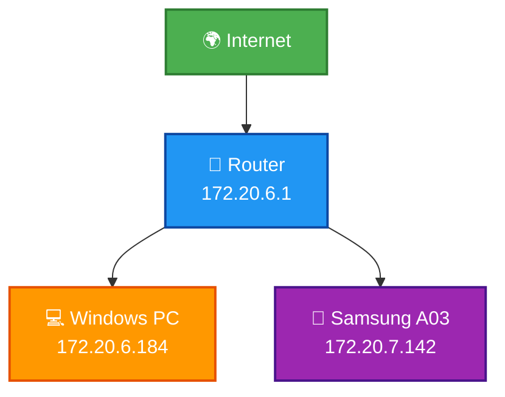
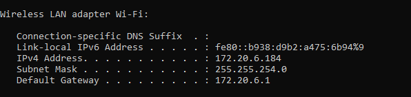
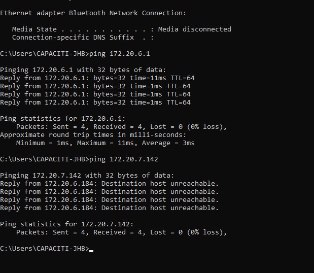
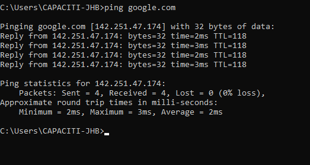

# 📡 Home Network Mapping & Ping Test

## 📌 Project Overview
This project maps my home network and verifies connectivity using `ipconfig` and `ping` commands.  
The objective is to identify connected devices, record IP configuration details, and confirm both local (LAN) and Internet connectivity.

---

## 🌐 Network Diagram



### Network Explanation
- Both the Windows PC and Samsung A03 connect to the router via Wi-Fi.
- The router (172.20.6.1) acts as the default gateway.
- The router connects the local network to the Internet.
- All devices are within the 172.20.x.x private IP range.

---

## 🖥 Device IP Configuration

| Device        | IP Address      | Subnet Mask     | Default Gateway |
|---------------|-----------------|----------------|-----------------|
| Windows PC    | 172.20.6.184    | 255.255.254.0  | 172.20.6.1      |
| Samsung A03   | 172.20.7.142    | 255.255.254.0  | 172.20.6.1      |
| Router        | 172.20.6.1      | —              | —               |

---

## 🧾 IP Configuration Screenshot

### Windows `ipconfig` Output



---

## 📡 Ping Test Results

### 1️⃣ Ping Router (LAN Connectivity)

Command used:
```
ping 172.20.6.1
```

Result:
- Replies received successfully
- 0% packet loss
- Confirms communication with the local router

Screenshot:



---

### 2️⃣ Ping Internet (External Connectivity)

Command used:
```
ping google.com
```

Result:
- Replies received successfully
- 0% packet loss
- Confirms active Internet connection

Screenshot:



---

## ✅ Network Analysis Summary

The Windows PC (172.20.6.184) and Samsung A03 (172.20.7.142) are successfully connected to the router (172.20.6.1).  
Ping tests confirm:

- Successful LAN communication
- Successful Internet connectivity
- No packet loss observed
- Stable and functional network configuration

The home network is operating correctly and all devices are properly connected.

---

## 📂 Repository Contents

```
network-mapping-ping-test/
│
├── README.md
├── ipconfig.png
├── ping internet.png
└── ping router&phone.png
```
